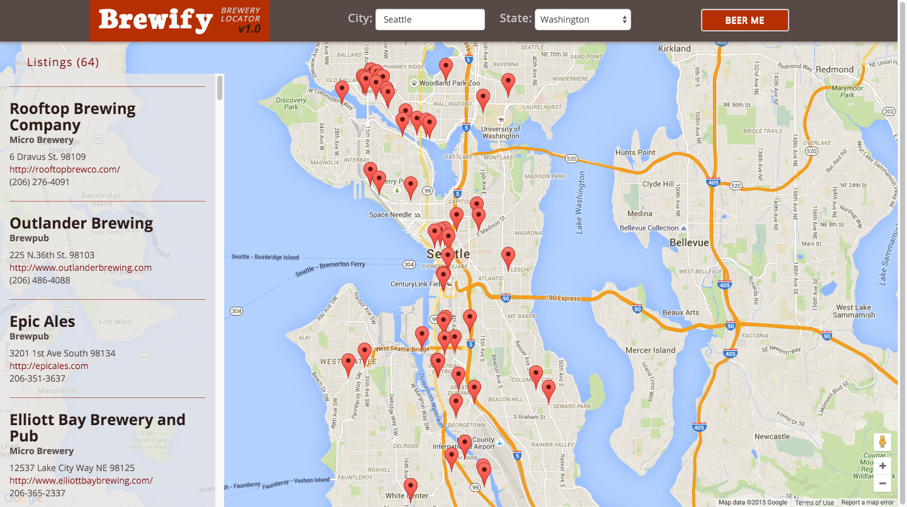
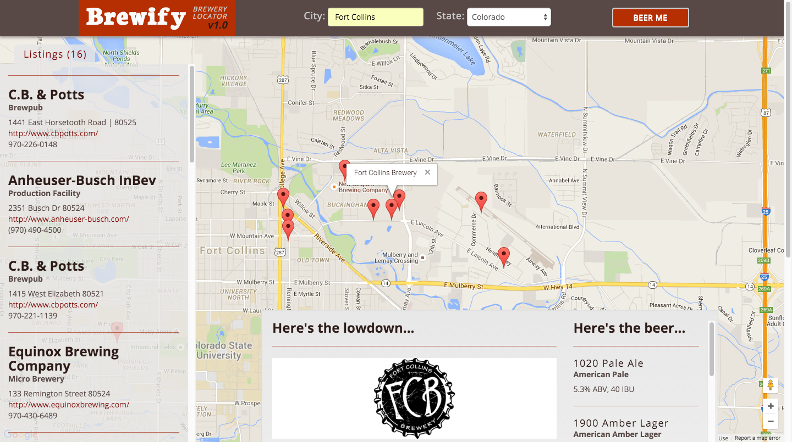

# Brewify 1.0
Brewify is a brewery locator app. Users can enter the city and state where they’d like to find breweries, click “BEER ME,” and Brewify returns a map pinning all locations as well as listings with contact info, individual brewery descriptions, logos, and beer lists if available. The purpose of the app is to give beer drinkers and travelers a reliable source for finding breweries or researching other areas and their beer scene. Although there are many ways to find and locate brewery information, Brewify gives users access through an aesthetically pleasing and intuitive interface.

